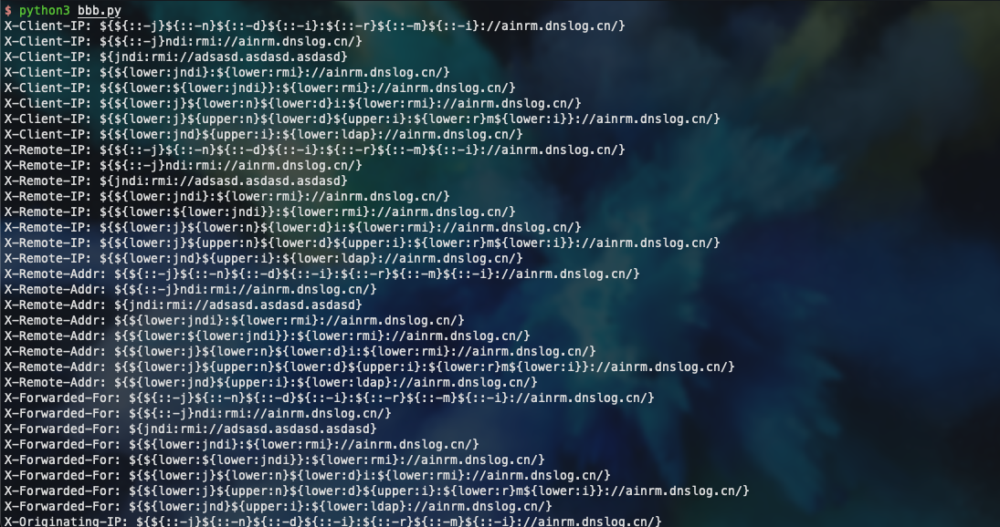
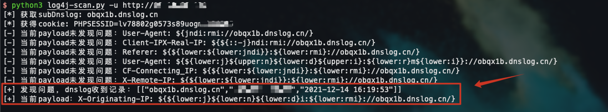

#### #1 使用说明

CVE-2021-44228 log4j 2.x rce漏洞检测工具，对目标链接发起get请求并利用dnslog探测是否有回显

```bash
$ python3 log4j-scan.py -h
Usage: python log4j-scan.py -u <target url>

Options:
  -h, --help         show this help message and exit
  -u URL, --url=URL  输入需要检查的链接，如: https://ainrm.cn
```

#### #2 过程截图

1. 内置8个公开payload与18个请求头，共144种组合方式



2. `-u`形式传入链接


